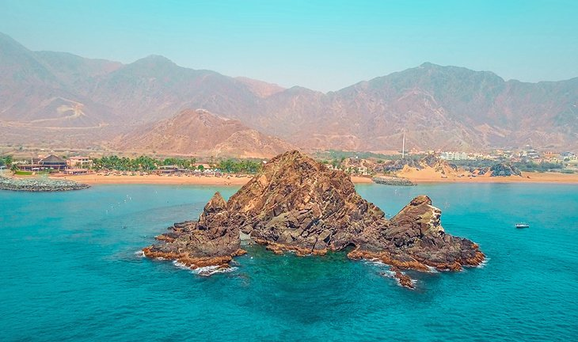

<!DOCTYPE html PUBLIC 

<head>

  <meta charset= "utf =8">
	<title> UAE</title>
	<link rel="icon" type="text/css" href="logo.ico">

	
		
</head>
<body>
<section id="navi">
	<nav> 
		
		
		<ul>
			<li> <a href = "#"> Home</li>
			<li> <a href = "#"> Emirates</li>
			<li> <a href = "#"> EXPO 2020</li>
		</ul>
	</nav>
</a></li></a></li></a></li></a></li></ul></nav>
  
<section class ="intro" id = "intro1">	
<h1 style="font-size:200%; text-align:center; color: darkblue;" ><b><u> UNITED ARAB EMIRATES</u></b></h1>

The UAE overlooks the Arabian Gulf and borders the Kingdom of Saudi Arabia to the South and West and the Sultanate of Oman to the Southeast.
The UAE has a warm and sunny weather most of the year, recording an ideal temperature from October to May.
The Emirati Dirham is the official national currency. The US dollar is exchanged for the UAE Dirham at a rate of 3.67, and credit cards are widely accepted.
The UAE hosts large foreign communities and all residents enjoy freedom of civil rights and practice of religion.
Arabic is the official language and English is widely spoken in public, markets and restaurants.
The UAE time is 4 hours ahead of GMT.

Historically the domain of individual Arab clans and families, the region now comprising the emirates also has been influenced by Persian culture owing to its close proximity to Iran, and its porous maritime borders have for centuries invited migrants and traders from elsewhere. In the 18th century, Portugal and the Netherlands extended their holdings in the region but retreated with the growth of British naval power there; following a series of truces with Britain in the 19th century, the emirates united to form the Trucial States (also called Trucial Oman or the Trucial Sheikhdoms). The states gained autonomy following World War II (1939–45), when the trucial states of Bahrain and Qatar declared independent statehood. The rest were formally united in 1971, with the city of Abu Dhabi serving as the capital. The stability of the federation has since been tested by rivalries between the families governing the larger states of Abu Dhabi and Dubai, though external events such as the Persian Gulf War (1990–91) and an ongoing territorial dispute with Iran have served to strengthen the emirates’ political cohesion.

	<h3 style="text-align:left;" ><u><B><I> MAP OF UAE </I></B></u></h3>
	
			

			
				<h3 style="text-align:center;" ><u><B><I> FLAG OF UAE </I></B></u></h3>
	
			
For More Details click <a class="button" href="https://www.britannica.com/place/United-Arab-Emirates/Land" target = "_blank"> Here </a>

			 
<section class="intro" id ="emirates" >
  <h1 style="font-size: 150%;">  Emirates </h1>

  
The United Arab Emirates is a federation of seven emirates, "with Abu Dhabi as its capital, located in the Western Asia on the Eastern Coast of the Arabian Peninsula. The seven emirates are: Abu Dhabi, Dubai, Sharjah, Ajman, Umm Al Quwain, Ras Al Khaimah and Fujairah. The UAE was founded on 2nd December 1971, and celebrates the day as its National Day every year. The year 2021 coincides with the celebration of the 50th anniversary of its establishment.

  
 
	 <h1 style ="text-align:center; font-size= 100%">Emirates of UAE</h1>
	 

	
     

			 
			  

				 <h3><u>ABU DHABI</u></h3>
				 
Abu Dhabi  is the capital and the second-most populous city (after Dubai) of the United Arab Emirates. It's also the capital of the Emirate of Abu Dhabi. The city of Abu Dhabi is located on an island in the Persian Gulf, off the Central West Coast. MMost of the city and the Emirate reside on the mainland connected to the rest of the country.

				 <a class="button" href="https://visitabudhabi.ae/en" target = "_blank"> More Info </a>
			  

		  

     

			 
			  

				 <h3><u>DUBAI</u></h3>
				 
Dubai is the most populous city in the United Arab Emirates. It is the capital of the Emirate of Dubai. Established in the 18th century as a small fishing village, the cirt grew rapidly in the early 21st century into a cosmopolitan metropolis with a focus on tourism and hospitality.

				 <a class="button" href="https://www.visitdubai.com/en/" target = "_blank"> More Info </a>
		 	 

		 

    

			 
			 

			 	 <h3><u>SHARJAH</u></h3>
			  	
Sharjah is the third-most populous city in the United Arab Emirates, after Dubai and Abu Dhabi.Sharjah is the capital of the emirate Sharjah. The emirate shares legal, political, military and economic functions with the other emirates of the UAE within a federal framework, although each emirate has jurisdiction over some functions such as civil law enforcement and provision and upkeep of local facilities. 

				 <a class="button" href="https://en.wikipedia.org/wiki/Sharjah" target = "_blank"> More Info </a>
			 

		 

    

		  	
			   

				 <h3><u>AJMAN</u></h3>
				 
Ajman is the capital of the emirate of Ajman in the United Arab Emirates. It is the fifth-largest city in UAE after Dubai, Abu Dhabi, Sharjah and Al Ain. Located along the Persian Gulf, it is engulfed by the larger emirate of Sharjah in territory.

				 <a class="button" href="https://www.ajman.ae/en" target = "_blank"> More Info </a>
			 

		 

    

		  	
			   

				  <h3><u>UMM AL QUWAIN</u></h3>
				   
Umm Al Quwain is the capital and largest city of the Emirate of Umm Al Quwain in the United Arab Emirates.The city is located on the peninsula of Khor Al Bidiyah, with the nearest major cities being Sharjah to the southwest and Ras Al Khaimah to the northeast. There are mangroves outside the city along the coast, with the local economy being largely fishing.

			   	<a class="button" href="https://u.ae/en/about-the-uae/the-seven-emirates/umm-al-quwain" target = "_blank"> More Info </a>
			  

		 

    

			  
			   

				  <h3><u>RAS AL KHAIMAH</u></h3>
				  
Ras Al Khaimah (RAK) is the largest city and capital of the Emirate of Ras Al Khaimah, United Arab Emirates. It is the sixth-largest city in UAE after Dubai, Abu Dhabi, Sharjah, Al Ain and Ajman.The city is divided by a creek into two parts: old town in the west and Al Nakheel in the east.

				  <a class="button" href="https://visitrasalkhaimah.com/" target = "_blank"> More Info </a>
			   

	  	

    

			 
			   

				  <h3><u>FUJAIRAH</u></h3>
				   
Fujairah City is the capital of the emirate of Fujairah in the United Arab Emirates.It is the seventh-largest city in UAE, located on the Gulf of Oman (part of the Indian Ocean). It is the only Emirati capital city on the UAE's east coast. The city of Fujairah is an industrial and commercial hub located on the east coast of the Indian Ocean that sits at the foothills of the Hajar Mountains.

				  <a class="button" href="https://u.ae/en/about-the-uae/the-seven-emirates/fujairah" target = "_blank"> More Info </a>
			   

		 

  

</section>
<section class="expo">
<h3 style="font-size: 150%"> <U>EXPO 2020</U></h3>

Expo 2020 (Arabic: إكسبو 2020) was a World Expo hosted by Dubai, in the United Arab Emirates, from 1 October 2021 to 31 March 2022. Originally scheduled for 20 October 2020 to 10 April 2021, it was postponed due to the COVID-19 pandemic. Despite being postponed, organizers kept the name Expo 2020 for marketing and branding purposes. The event had recorded more than 24 million visits in its six months.The Bureau International des Expositions (BIE) general assembly in Paris named Dubai as the host on 27 November 2013.

Here is the <a href =" https://www.expo2020dubai.com/" target = "_blank"><u>Official Website</u></a>
 
 

<h4><u>Glipmse of EXPO 2020</u></h4>

<iframe width="560" height="315" src="https://www.youtube.com/embed/wZMGJODhnbE" title="YouTube video player" frameborder="0" allow="accelerometer; autoplay; clipboard-write; encrypted-media; gyroscope; picture-in-picture" allowfullscreen></iframe>

</body></html>
